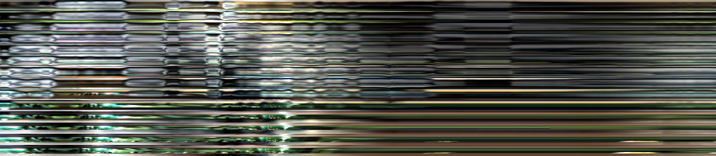

# RGB-NIR-rPPG

## Instructions
1. Download the <a href="https://computationalimaging.rice.edu/mr-nirp-dataset/">MR-NIRP </a>.

2. Clone the repo of <a href="https://github.com/ubicomplab/rPPG-Toolbox">rPPG-Toolbox</a> and put dataset/BaseLoader.py and MRNIRPLoader.py under the dataset/data_loader. Process the raw data

```
python main.py --config_file /RGB-NIR-rPPG/config/MR-NIRP.yaml
```

3. Generate STMap and heart rates

Extract the heart rates from the PPG signals. Run `postprocess.py`

Use the obtained csv file from toolbox and run `preprocess.py` to generate the STMap(CHROM, POS, RGB, YUV or NIR)

Cut the STMap into segments. Run `cut_dataset.py`


4. Run the training

```
python test_double.py --config_file /RGB-NIR-rPPG/config/fold1.yaml [--selected_topics <driving_still_940,garage_small_motion, etc...>]
``` 

## Dataset Examples

This is the example for RGB-STMap

</img>

5. New configuration files are updated

We uploaded the training configuration files in `/config/toolbox_config`, which can be runned by using toolbox. 
